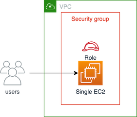
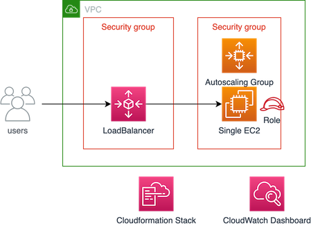
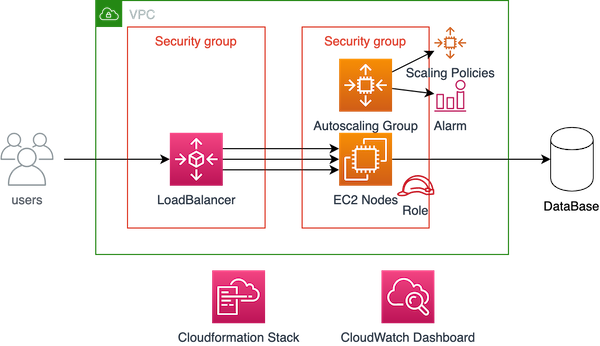
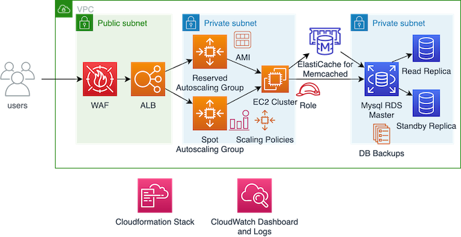

# Notejam AWS infrastructure

This repository contains an example of infrastructure for on-premise application which is going to be deployed in AWS public cloud
The application itself can be found in the git repo [notejam](https://github.com/nordcloud/notejam)

## Business Requirements
- The Application must serve variable amount of traffic. Most users are active during business hours. During big events and conferences the traffic could be 4 times more than typical
- The Customer takes guarantee to preserve your notes up to 3 years and recover it if needed
- The Customer ensures continuity in service in case of data center failures
- The Service must be capable of being migrated to any regions supported by the cloud provider in case of emergency
- The Customer is planning to have more than 100 developers to work in this project who want to roll out multiple deployments a day without interruption / downtime
- The Customer wants to provision separated environments to support their development process for development, testing, production in the near future
- The Customer wants to see relevant metrics and logs from the infrastructure for quality assurance and security purposes

## Assumptions
- Let’s assume we have 10M total users, with 1M daily active users
- Let's assume 10:1 ratio between read and write
- Let's assume 10M daily read requests with 1M daily write requests
- Let's assume 10:1 ratio between Notes and Pads
- Let's assume 10 Pads and 50 Notes per user

#### Traffic estimates
- 10M / (24 hours * 3600 seconds) ~= 120 reads/sec
- 1M / (24 hours * 3600 seconds) ~= 12 writes/sec

#### DataBase storage estimates
- Let’s assume we have three database tables User, Pad, Note with fields
  - User table: ID 2B, Email 120B, Password 100B
  - Pad table: ID 2B, Name 100B
  - Note table: ID 2B, Name 100B, Text 1KB
- User table storage (2B + 120B + 100B) * 10M ~= 2GB total
- Pad table storage (2B + 100B) * 10 * 10M ~= 1GB total
- Note table storage (2B + 120B + 1KB) * 50 * 10M ~= 540GB total
- Total Data Base storage needed (2GB + 1GB + 540GB) ~= 544GB total

#### Bandwidth estimates
- (2B + 120B + 1KB) * 120 reads ~= 140 KB/s for read requests
- (2B + 120B + 1KB) * 12 writes ~= 14 KB/s for write requests

## Minimum viable product
There are three possible environment configurations - development, testing, production.
All configurations include VPC, three public subnets, internet gateway.
There are Cloudformation templates for VPC, ELB, ASG and Jenkinsfiles to create Cloudformation stacks using [Jenkins](https://jenkins.io/).
All EC2 instances are provisioned from standard `Ubuntu Server 18.04 LTS (HVM), SSD Volume Type` AMIs. 
- Development environment includes security group with opened port 5000 and single instance 
- Testing and production environments include classic load balancer, two security groups, autoscalig group and launch configuration
- Testing environment provisions only one EC2 instance without scaling
- Production environment in addition has two scaling policies based on CPU Cloudwatch alarms
- Production environment must have existing deployed MySql database

CloudFormation templates for MVP can be found in [deployment](/deployment) folder

## Minimum viable development environment
Estimated costs using free tier `t2.micro` instance ~= 0$

## Minimum viable testing environment
Estimated costs for `eu-central-1` per deployment per month ~= 29$ in total
- Spot EC2 `t3.micro` ~= 4$
- Classic Load Balancer with 50GB processed data ~= 22$ per month
- CloudWatch Dashboard ~= 3$

## Minimum viable production environment
Estimated costs for `eu-central-1` per deployment per month ~= 236$ in total
- On-Demand EC2 `c5.large` *3x ~= 210$
- Classic Load Balancer with 50GB processed data ~= 22$ per month
- CloudWatch Dashboard ~= 3$
- CloudWatch Alarms ~= 0.20$

## Further Improvements
1. Database
    - If new database is needed, it can be provisioned using MySql or Aurora RDS instances
    - For high availability and reliability the MultiAZ configuration with one read replica can be used
    - For backups automatic snapshots once a day with 1 month retention period can be used
    - Estimated costs for `eu-central-1` MySql cluster ~= 301$ per month
        - Multi-AZ Partial Upfront Reserved `db.m5.large` instance ~= 50$ per month
        - Multi-AZ standby instance ~= 50$ per month
        - Replica instance ~= 50$ per month
        - Multi-AZ General Purpose (SSD) Storage for 544GB ~= 150$ per month
        - Data Transfer for 12GB data ~= 0.23$ per month
        - There is no additional charge for backup storage for a region
2. Cache
    - Amazon ElastiCache for Memcached could be used to support the most demanding applications requiring sub-millisecond response times
    - Cache backups are not mandatory
    - Estimated costs for `eu-central-1` Memcached instance ~= 44$ per month
        - Partial Upfront Reserved `cache.m5.large` instance ~= 43$ per month
        - Data Transfer for 12GB data ~= 0.12$ per month
3. Auto scaling group and EC2 instances
    - For high availability at least one instance per AZ must be used
    - For reducing costs one asg with 3 reserved instances and one asg with spot instances can be used
    - For fast instance provisioning and startup pre-baked AMIs using [packer](https://packer.io/) and [ansible](https://www.ansible.com/) could be used
    - Estimated costs for `eu-central-1` ~= 370$ per month
        - Reserved EC2 `c5.xlarge` *3x ~= 210$ per month
        - Spot EC2 `c5.xlarge` *3x ~= 160$ per month
4. Load Balancer
    - For requests logging Access Logs with 3 month retention period can be used
    - Classic load balancer can be replaced with application load balancer for further configuration and security improvements
    - For security reasons ssl certificate can be used
    - Estimated costs for `eu-central-1` ~= 25$ per month
        - Access logs S3 storage for 30GB ~= 1$
        - Application Load Balancer for 700 connections per minute, 200GB data transfer per month ~= 23$ per month
        - SSL Certificate ~= 0.75$ per certificate
5. Firewall
    - AWS WAF can be used to protect web applications against common web exploits
    - Estimated costs ~= 196$ per month
        - Web ACL ~= 5$ per month
        - Rule price for 5 rules ~= 5$ per month
        - Price for 310M requests per month ~ = 186$ per month
6. DNS
    - Route53 service could be used for managing DNS names and ELB routes
    - Estimated costs ~= 3.5$ per month
        - Domain name ~= 3$ per month
        - Hosted zone ~= 0.50$ per month
7. Cloudwatch
    - Additional widgets - NetworkIn/NetworkOut, Latency, Bad requests count - could be added to Cloudwatch dashboard
    - Logs form EC2 instances could be streamed to Cloudwatch Log Groups using Cloudwatch agent. Retention period - 3 month
    - Cloudwatch logs could be parsed for creating additional metrics and Cloudwatch Alarms
    - For more precise data analysing Cloudwatch detailed monitoring could be used
    - Estimated costs for additional improvements for `eu-central-1` ~= 40$ per month
        - Log storage for 30GB ~= 18$ per month
        - CloudWatch Metrics 10 metrics * 6 instances ~= 18$ per month
        - High Resolution Alarm *10 ~= 3$ per month
8. Security
    - To provide secure access to instances located in the private and public subnets, bastion host could be provisioned
    - The alternative connection without bastion host - SSM Session Manager
    - SSL/TLS connections could be used to encrypt data in transit
    - Amazon RDS database storage and backups at rest could be encrypted using Amazon Key Management Service (KMS)
9. Disaster recovery strategy
    - For redundancy and reducing latency separate cluster in another region could be provisioned 
    - In case of potential disaster Database fails over to stand by replica
    - In case of entire region disaster - incoming traffic could be shifted to another region using Route53 Failover Routing Policy
    
Some templates for improvements can be found in [additional](/additional) folder

Result: Total estimated costs for `eu-central-1` for improved one region cluster per month ~= 980$ in total

